||||
| :- | :-: | -: |

**PONTIFÍCIA UNIVERSIDADE CATÓLICA DO PARANÁ**

PROJETO DE BANCO DE DADOS 

2ª PARTE

**CineView**

Equipe:

Ana Julia Rocha Cezanoski,

Léo Tony Zwieczykowski,

Lucas Nascimento da Silva,

Luiz Eduardo Leal de Oliveira.

Curitiba

Novembro de 2023
||||
| :- | :-: | -: |

Sumário

[1	Domínio de Aplicação para o Banco de Dados	3](#_toc393516977)

[1.1	Identificação do Projeto	3](#_toc2006750816)

[1.2	Tema do Projeto	3](#_toc1908440452)

[1.3	Usuários do sistema	3](#_toc672272216)

[1.4	Funcionalidade 1 do Projeto	3](#_toc1351567607)

[1.5	Funcionalidade 2 do Projeto	3](#_toc1281303573)

[2	Modelo Conceitual	4](#_toc42559530)

[3	Modelo Lógico (3FN)	5](#_toc2133822257)

[4	Modelo Lógico (3FN)	6](#_toc1392738563)

[5	Modelo Físico (3FN)	7](#_toc663449489)

[5.1	SQL para criação de tabelas e restrições	7](#_toc685451885)

[5.2	SQL para inserção de pelo menos 15 registros para cada tabela	10](#_toc1777438470)

[6	Consultas e Programação	17](#_toc1388994099)

[6.1	SQL para 3 consultas com AGREGAÇÃO de recuperação de dados	17](#_toc674087307)

[6.2	SQL para 3 consultas com IR (PK + FK) de recuperação de dados	19](#_toc559110447)

[6.3	1 Stored procedure	22](#_toc1123440608)

[6.4	1 Trigger	24](#_toc780368612)
||||
| :- | :-: | -: |

1. # **Domínio de Aplicação para o Banco de Dados**
   1. ## **Identificação do Projeto**
      Nome Projeto: *CineView*

      Logomarca:

      

   2. ## **Tema do Projeto**
      Explicar em detalhes qual o objetivo do sistema que precisa de BD.

      A área de negócio do nosso sistema é a de avaliação de filmes, que combina entretenimento e recomendações personalizadas baseadas no gênero preferido dos usuários, para melhorar a experiência daqueles que amam cinema. Esse sistema permite que os usuários acessem várias informações sobre uma grande variedade de filmes, como títulos, ano de lançamento, sinopse, gênero do filme, diretor, estúdio, elenco e avaliações sobre ele, além de poderem avaliar os filmes que assistiram e compartilhar opiniões sobre. O usuário também pode pesquisar por gênero, diretor, estúdio e ator. O sistema manterá sempre um banco de dados atualizado e organizado de filmes e recomendações baseadas nos gêneros mais apreciados pelos usuário e nos filmes com melhores avaliações.
      
   3. ## **Usuários do sistema**  
      Indicar quais os potenciais usuários do sistema (usuário que precisar realizar LOGIN).

      A princípio terá 2 usuários: o *cliente*, que fará cadastro e utilizará o sistema, e o *administrador*, que será responsável por gerenciar todo o sistema, como na constante atualização do catálogo de filmes.
      
   4. ## **Funcionalidade 1 do Projeto**
      Indicar uma funcionalidade (requisito funcional) que deve ser implementada para atender uma necessidade do usuário, utilizando os dados em BD.

      A primeira funcionalidade do projeto é a de cadastro do usuário e do administrador.
      
   5. ## **Funcionalidade 2 do Projeto**
      Indicar uma funcionalidade (requisito funcional) que deve ser implementada para atender uma necessidade do usuário, utilizando os dados em BD.

      A segunda funcionalidade do projeto é a de o usuário conseguir fazer a avaliação de um filme, adicionando uma nota (de 0 a 9) para ele e um comentário.
      
||||
| :- | :-: | -: |

2. # **Modelo Conceitual**
   Imagem de boa resolução do Modelo Conceitual (**Modelo Entidade-Relacionamento - MER**) na **3FN**

   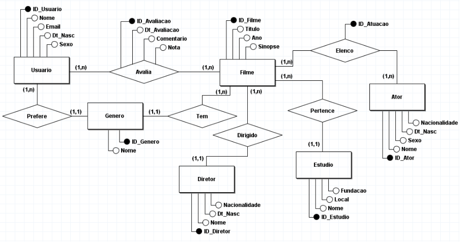
   
||||
| :- | :-: | -: |

3. # **Modelo Lógico (3FN)**
   Imagem de boa resolução do Modelo Lógico (**Modelo Relacional - MR**) na **3FN**, feito com o **brModelo**.

   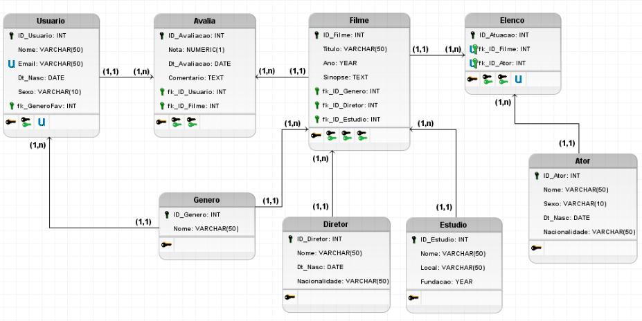
   
4. # **Modelo Lógico (3FN)**
   Imagem de boa resolução do Modelo Lógico (**Modelo Relacional - MR**) na **3FN**, feito com o **ENGENHARIA REVERSA do MySQL Workbench**.

   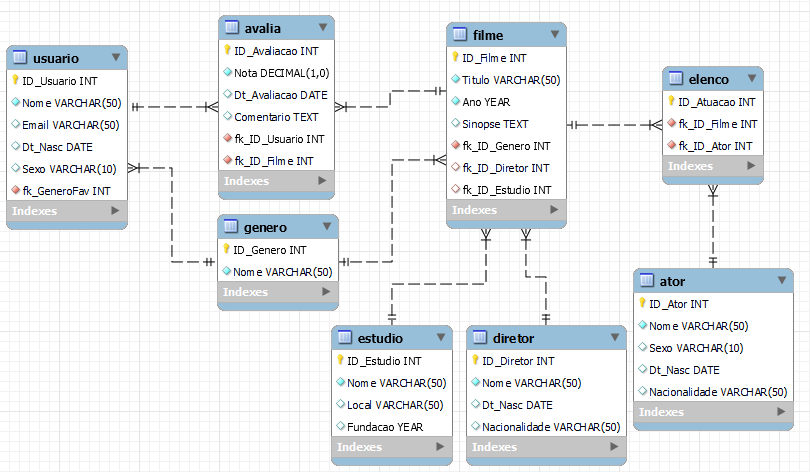

||||
| :- | :-: | -: |

5. # **Modelo Físico (3FN)**
   1. ## **SQL para criação de tabelas e restrições** 
      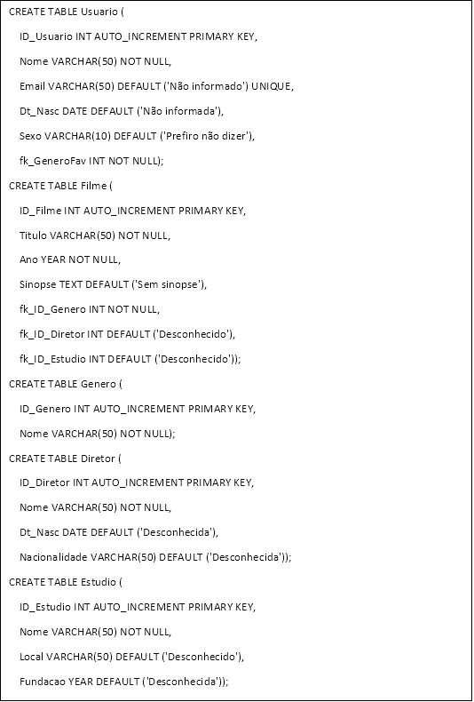
      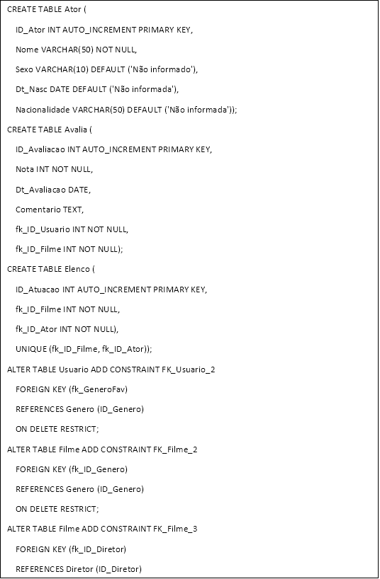
      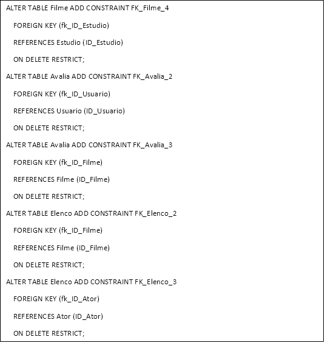

   2. ## **SQL para inserção de pelo menos 15 registros para cada tabela**  
      Importante: Indicar em imagens de boa resolução, o resultado de cada comando de INSERT.

      |
INSERT INTO Genero (Nome) VALUES

 ('Comédia'), ('Ação'), ('Drama'), ('Aventura'), ('Suspense'), ('Romance'), ('Faroeste'), ('Musical'), ('Terror'), ('Ficção          Científica'), ('Fantasia'), ('Animação'), ('Documentário'), ('Thriller'), ('Espionagem');

    

SELECT \* FROM Genero;
|
      | :- |

      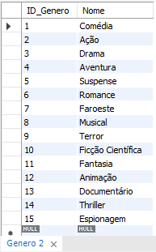
      
      |
INSERT INTO Usuario (Nome, Email, Dt\_Nasc, Sexo, fk\_GeneroFav) VALUES

 ('Ana Clara', 'anacl4ra@gmail.com', STR\_TO\_DATE('22/03/1998', '%d/%m/%Y'), 'Feminino', 3),

 ('Paulo Sérgio', 'paulin433@gmail.com', STR\_TO\_DATE('06/05/2004', '%d/%m/%Y'), 'Masculino', 6),

 ('Carlos', 'carlosppd@yahoo.com', STR\_TO\_DATE('30/01/1989', '%d/%m/%Y'), 'Masculino', 1),

 ('Pedro Mendes', 'pedromendes12@gmail.com', STR\_TO\_DATE('15/10/2002', '%d/%m/%Y'), 'Masculino', 8),

 ('Enzo', NULL, STR\_TO\_DATE('27/08/2005', '%d/%m/%Y'), 'Masculino', 1),

 ('Vitória Freitas', 'vickfrei30@gmail.com', STR\_TO\_DATE('02/07/2001', '%d/%m/%Y'), 'Feminino', 11),

 ('Rai Alvez', 'raialveees@hotmail.com', STR\_TO\_DATE('28/11/2000', '%d/%m/%Y'), NULL, 2),

 ('Roberta', 'robertavascons2@yahoo.com', STR\_TO\_DATE('25/02/1981', '%d/%m/%Y'), 'Feminino', 15),

 ('Thiago Prestes', 'th1agoPrr@gmail.com', STR\_TO\_DATE('08/02/2003', '%d/%m/%Y'), 'Masculino', 1),

 ('Julia Campos', 'jucamp56@gmail.com', NULL, 'Feminino', 12),

 ('Pedro Gustavo', 'pedrokaguuu@gmail.com', STR\_TO\_DATE('11/09/2004', '%d/%m/%Y'), 'Masculino', 10),

 ('Sky Barbosa', 'skyyybarbie@gmail.com', STR\_TO\_DATE('26/06/2006', '%d/%m/%Y'), NULL, 2),

 ('Paulo', 'matiaspaulo38@hotmail.com', STR\_TO\_DATE('01/12/1998', '%d/%m/%Y'), 'Masculino', 13),

 ('Amanda Carvalho', 'mandscarvalho@gmail.com', STR\_TO\_DATE('14/03/2002', '%d/%m/%Y'), 'Feminino', 3),

 ('Luiz Antônio', 'luiz006kubrick@gmail.com', STR\_TO\_DATE('08/05/2001', '%d/%m/%Y'), 'Masculino', 14);

    

SELECT \* FROM Usuario;
|
      | :- |

      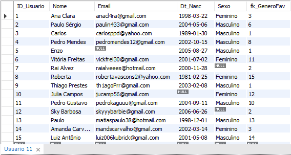

      |
INSERT INTO Diretor (Nome, Dt\_Nasc, Nacionalidade) VALUES

 ('Greta Gerwig', STR\_TO\_DATE('04/08/1983', '%d/%m/%Y'), 'Norte-americana'),

 ('Christopher Nolan', STR\_TO\_DATE('30/07/1970', '%d/%m/%Y'), 'Britânico'),

 ('Quentin Tarantino', STR\_TO\_DATE('27/03/1963', '%d/%m/%Y'), 'Norte-americano'),

 ('Danny Philippou', STR\_TO\_DATE('13/11/1992', '%d/%m/%Y'), 'Australiano'),

 ('Bong Joon-ho', STR\_TO\_DATE('14/09/1969', '%d/%m/%Y'), 'Sul-coreano'),

 ('Peter Ramsey', STR\_TO\_DATE('23/12/1962', '%d/%m/%Y'), 'Norte-americano'),

 ('Joseph Kosinski', STR\_TO\_DATE('03/05/1974', '%d/%m/%Y'), 'Norte-americano'),

 ('Daniel Kwan', STR\_TO\_DATE('10/02/1988', '%d/%m/%Y'), 'Norte-americano'),

 ('Stanley Kubrick', STR\_TO\_DATE('26/07/1928', '%d/%m/%Y'), 'Norte-americano'),

 ('Steven Spielberg', STR\_TO\_DATE('18/12/1946', '%d/%m/%Y'), 'Norte-americano'),

 ('Francis Lawrence', STR\_TO\_DATE('26/03/1971', '%d/%m/%Y'), 'Austríaco'),

 ('Chloé Zhao', STR\_TO\_DATE('31/03/1982', '%d/%m/%Y'), 'Chinesa'),

 ('Andy Muschietti', STR\_TO\_DATE('26/08/1973', '%d/%m/%Y'), 'Argentino'),

 ('George Lucas', STR\_TO\_DATE('14/05/1944', '%d/%m/%Y'), 'Norte-americano'),

 ('Guillermo del Toro', STR\_TO\_DATE('09/10/1964', '%d/%m/%Y'), 'Mexicano');

    

SELECT \* FROM Diretor;
|
      | :- |

      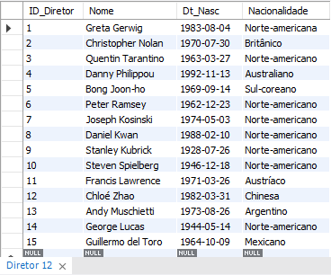

      |
INSERT INTO Estudio (Nome, Local, Fundacao) VALUES 

 ('Mattel Films', 'Califórnia, EUA', 2013),

 ('Warner Bros.', 'Califórnia, EUA', 1923),

 ('Universal Pictures', 'Nova Iorque, EUA', 1912),

 ('Miramax', 'Nova Iorque, EUA', 1979),

 ('Causeway Films', 'Sydney, Austrália', 2014),

 ('A24', 'Nova Iorque, EUA', 2012),

 ('CJ E&M', 'Seul, Coreia do Sul', 2011),

 ('Sony Pictures', 'Califórnia, EUA', 1987),

 ('Paramount Pictures', 'Los Angeles, EUA', 1912),

 ('Studio Ghibli', 'Tóquio, Japão', 1985),

 ('Lionsgate Films', 'Santa Mônica, EUA', 1997),

 ('Marvel Studios', 'Nova Iorque, EUA', 1993),

 ('New Line Cinema', 'Califórnia, EUA', 1967),

 ('Lucasfilm', 'Califórnia, EUA', 1971),

 ('Netflix Animation', 'Califórnia, EUA', 2018);

    

SELECT \* FROM Estudio;
|
      | :- |

      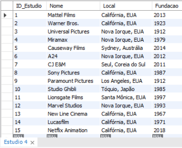

      |
INSERT INTO Filme (Titulo, Ano, Sinopse, fk\_ID\_Genero, fk\_ID\_Diretor, fk\_ID\_Estudio) VALUES

 ('Barbie', 2023, 'Depois de ser expulsa da Barbieland por ser uma boneca de aparência menos do que perfeita, Barbie parte para o mundo humano em busca da verdadeira felicidade.', 1, 1, 2),

 ('Oppenheimer', 2023, 'O físico J. Robert Oppenheimer trabalha com uma equipe de cientistas durante o Projeto Manhattan, levando ao desenvolvimento da bomba atômica.', 3, 2, 3),

 ('Kill Bill - Volume 1', 2003, 'A ex-assassina conhecida apenas como Noiva acorda de um coma de quatro anos decidida a se vingar de Bill, seu ex-amante e chefe, que tentou matá-la no dia do casamento.', 2, 3, 4),

 ('Talk to Me', 2023, 'Um grupo de amigos descobre uma mão embalsamada que lhes permite conjurar espíritos. Viciado na emoção, um deles vai longe demais e abre a porta para o mundo espiritual.', 9, 4, 5),

 ('Parasita', 2019, 'Toda a família de Ki-taek está desempregada, vivendo em um porão sujo e apertado. Por obra do acaso, ele começa a dar aulas de inglês para uma garota de família rica.', 14, 5, 7),

 ('Homem-Aranha no Aranhaverso', 2019, 'Após ser atingido por uma teia radioativa, Miles Morales, um jovem negro do Brooklyn, se torna o Homem-Aranha, inspirado no legado do já falecido Peter Parker.', 12, 6, 8),

 ('Top Gun: Maverick', 2022, 'Depois de mais de 30 anos de serviço como um dos principais aviadores da Marinha, Pete "Maverick" Mitchell está de volta, rompendo os limites como um piloto de testes corajoso.', 2, 7, 9),

 ('Tudo em Todo o Lugar ao Mesmo Tempo', 2022, 'Uma ruptura interdimensional bagunça a realidade e uma inesperada heroína precisa usar seus novos poderes para lutar contra os perigos bizarros do multiverso.', 10, 8, 6),

 ('O Iluminado', 1980, 'Jack Torrance se torna caseiro de inverno do isolado Hotel Overlook, nas montanhas do Colorado, na esperança de curar seu bloqueio de escritor. Ele se instala com a esposa Wendy e o filho Danny, que é atormentando por premonições.', 9, 9, 2),

 ('Jogador Nº 1', 2018, 'Em 2045, Wade Watts, assim como o resto da humanidade, prefere a realidade virtual do jogo OASIS ao mundo real. James Halliday, o excêntrico criador do jogo, morre e deixa sua fortuna inestimável para a primeira pessoa que descobrir a chave de um quebra-cabeça diabólico que ele arquitetou.', 10, 10, 2),

 ('Jogos Vorazes - Em Chamas', 2013, 'Após saírem vencedores da última edição dos Jogos Vorazes, as atitudes desafiadoras de Katniss e Peeta acabam inspirando uma rebelião contra a opressiva Capital.', 2, 11, 11),

 ('Eternos', 2021, 'Os Eternos são uma raça de seres imortais que viveram durante a antiguidade da Terra, moldando sua história e suas civilizações enquanto batalhavam os malignos Deviantes.', 11, 12, 12),

 ('It - A Coisa', 2017, 'Um grupo de crianças se une para investigar o misterioso desaparecimento de vários jovens em sua cidade. Eles descobrem que o culpado é Pennywise, um palhaço cruel que se alimenta de seus medos e cuja violência teve origem há vários séculos.', 9, 13, 13),

 ('Star Wars: Episódio I – A Ameaça Fantasma', 1999, 'Obi-Wan e seu mentor embarcam em uma perigosa aventura na tentativa de salvar o planeta das garras de Darth Sidious. Durante a viagem, eles conhecem um habilidoso menino e decidem treiná-lo para se tornar um Jedi.', 10, 14, 14),

 ('Pinóquio', 2022, 'O desejo de um pai solitário dá vida magicamente a um boneco de madeira, seu nome é Pinóquio. Confuso por ser tão diferente das outras crianças, Pinóquio foge de casa para encontrar seu lugar no mundo e se depara com perigo e aventura.', 11, 15, 15);

    

SELECT \* FROM Filme;
|
      | :- |

      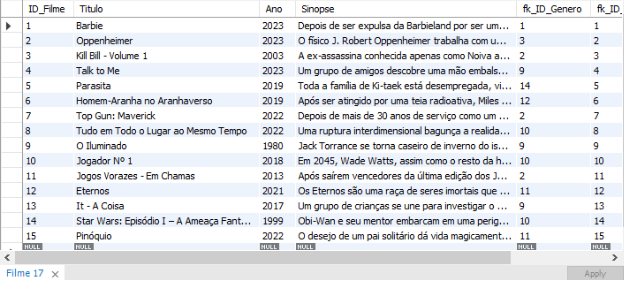

      |
INSERT INTO Avalia (Nota, DT\_Avaliacao, Comentario, fk\_ID\_Usuario, fk\_ID\_Filme) VALUES

 (8, STR\_TO\_DATE('05/09/2022', '%d/%m/%Y'), NULL, 8, 9),

 (6, STR\_TO\_DATE('20/10/2023', '%d/%m/%Y'), 'Não consegui sentir tanto medo com o filme e não gostei do final, mas é mediano', 10, 4),

 (9, STR\_TO\_DATE('08/09/2023', '%d/%m/%Y'), 'Acho que foi a melhor animação que já vi, adorei o estilo totalmente diferente que criaram.', 12, 6),

 (7, STR\_TO\_DATE('12/02/2023', '%d/%m/%Y'), 'Gostei, só achei um pouco monótono', 4, 12),

 (9, STR\_TO\_DATE('09/10/2023', '%d/%m/%Y'), 'AMEI!! Melhor terror de 2023', 6, 4),

 (0, STR\_TO\_DATE('20/08/2023', '%d/%m/%Y'), 'ODIEI', 5, 1),

 (8, STR\_TO\_DATE('22/08/2023', '%d/%m/%Y'), 'Filmasso!', 3, 2),

 (5, STR\_TO\_DATE('12/11/2022', '%d/%m/%Y'), 'Não entendi nada desse filme, mas parece bem feito. Minha filha que falou pra eu assistir.', 8, 5),

 (9, STR\_TO\_DATE('20/12/2022', '%d/%m/%Y'), 'Sou apaixonado por Star Wars <3', 15, 14),

 (9, STR\_TO\_DATE('04/05/2023', '%d/%m/%Y'), 'Um dos melhores filmes de terror, amo os personagens.', 1, 13),

 (7, STR\_TO\_DATE('30/07/2023', '%d/%m/%Y'), NULL, 9, 9),

 (9, STR\_TO\_DATE('06/09/2023', '%d/%m/%Y'), 'Mereceu o oscar que ganhou <3', 7, 8),

 (2, STR\_TO\_DATE('21/08/2023', '%d/%m/%Y'), 'Filme chato', 10, 7),

 (9, STR\_TO\_DATE('23/10/2023', '%d/%m/%Y'), 'QUE FILME F\*D4', 11, 2),

 (8, STR\_TO\_DATE('15/10/2023', '%d/%m/%Y'), 'Filme divertido demais, muito legal de assistir com a família e amigos.', 2, 10);

    

SELECT \* FROM Avalia;
|
      | :- |

      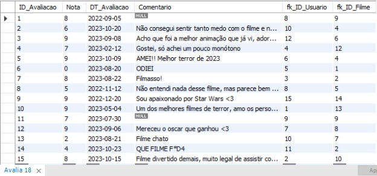

      |
INSERT INTO Ator (Nome, Sexo, Dt\_Nasc, Nacionalidade) VALUES

 ('Margot Robbie', 'Feminino', STR\_TO\_DATE('02/07/1990', '%d/%m/%Y'), 'Australiana'),

 ('Robert Downey Jr.', 'Masculino', STR\_TO\_DATE('04/04/1965', '%d/%m/%Y'), 'Norte-americano'),

 ('Cillian Murphy', 'Masculino', STR\_TO\_DATE('25/05/1976', '%d/%m/%Y'), 'Irlandês'),

 ('Uma Thurman', 'Feminino', STR\_TO\_DATE('29/04/1970', '%d/%m/%Y'), 'Norte-americana'),

 ('Sophie Wilde', 'Feminino', STR\_TO\_DATE('05/07/1997', '%d/%m/%Y'), 'Australiana'),

 ('Tom Cruise', 'Masculino', STR\_TO\_DATE('03/07/1962', '%d/%m/%Y'), 'Norte-americano'),

 ('Michelle Yeoh', 'Feminino', STR\_TO\_DATE('06/08/1962', '%d/%m/%Y'), 'Malaia-chinesa'),

 ('Ke Huy Quan', 'Masculino', STR\_TO\_DATE('20/08/1971', '%d/%m/%Y'), 'Vietnamita'),

 ('Jack Nicholson', 'Masculino', STR\_TO\_DATE('22/04/1937', '%d/%m/%Y'), 'Norte-americano'),

 ('Tye Sheridan', 'Masculino', STR\_TO\_DATE('11/11/1996', '%d/%m/%Y'), 'Norte-americano'),

 ('Jennifer Lawrence', 'Feminino', STR\_TO\_DATE('15/08/1990', '%d/%m/%Y'), 'Norte-americana'),

 ('Kit Harington', 'Masculino', STR\_TO\_DATE('26/12/1986', '%d/%m/%Y'), 'Britânico'),

 ('Angelina Jolie', 'Feminino', STR\_TO\_DATE('04/06/1975', '%d/%m/%Y'), 'Norte-americana'),

 ('Bill Skarsgård', 'Masculino', STR\_TO\_DATE('09/08/1990', '%d/%m/%Y'), 'Sueco'),

 ('Natalie Portman', 'Feminino', STR\_TO\_DATE('09/06/1981', '%d/%m/%Y'), 'Israelense-americana');

    

SELECT \* FROM Ator;
|
      | :- |

      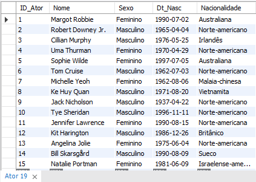

      |
INSERT INTO Elenco (fk\_ID\_Filme, fk\_ID\_Ator) VALUES

(1, 1), (2, 2), (2, 3), (3, 4), (4, 5), (7, 6), (8, 7), (8, 8), (9, 9), (10, 10), (11, 11), (12, 12), (12, 13), (13, 14), (14, 15);

    

SELECT \* FROM Elenco;
|
      | :- |

      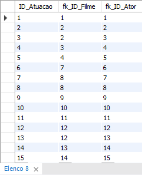
      
6. # **Consultas e Programação**
   Para consultas com referências entre tabelas, usar apenas JOIN.
   1. ## **SQL para 3 consultas com AGREGAÇÃO de recuperação de dados**
      **Consulta 1**: 

      1) Descreva por qual razão a consulta é importante para o usuário.

          A consulta é importante pois mostra a média das notas dos filmes, da maior para a menor, e a quantidade de avaliações feitas por filme.

      2) Código SQL 

         |
SELECT F.Titulo AS Filme, F.Ano AS 'Data de Lançamento', ROUND(AVG(A.Nota), 1) AS Nota, COUNT(A.ID\_Avaliacao) AS 'Quantidade de avaliações'

FROM Filme AS F LEFT JOIN Avalia AS A

ON (F.ID\_Filme = A.fk\_ID\_Filme)

GROUP BY F.ID\_Filme

ORDER BY Nota DESC;
|
         | :- |

      3) Resultado da consulta.

         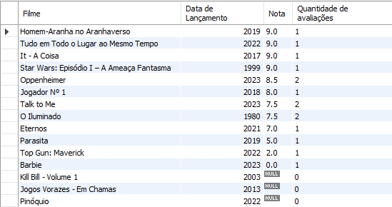

      **Consulta 2**: 

      1) Descreva por qual razão a consulta é importante para o usuário.

         A consulta é importante porque mostra a quantidade de filmes de cada gênero disponíveis, ordenados dos com mais opções para os com menos opções, e a quantidade de usuários que têm este gênero como favorito.

      2) Código SQL.

         |
SELECT G.Nome AS Gênero, COUNT(F.fk\_ID\_Genero) AS 'Filmes neste gênero',

(SELECT COUNT(\*) 	FROM Usuario AS U

WHERE U.fk\_GeneroFav = G.ID\_Genero) 'Quantidade de usuários que gostam deste gênero'

FROM Genero AS G LEFT JOIN Filme AS F

ON (G.ID\_Genero = F.fk\_ID\_Genero)

GROUP BY G.ID\_Genero

ORDER BY COUNT(F.fk\_ID\_Genero) DESC;
|
         | :- |

      3) Resultado da consulta.

         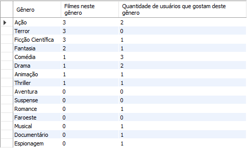

      **Consulta 3**: 

      1) Descreva por qual razão a consulta é importante para o usuário.

         A consulta é importante pois mostra todos os usuário que fizeram avaliações no sistema, do que mais fez para o que menos fez, os filmes que eles avaliaram e as notas que deram para cada filme.

      2) Código SQL.

         |
SELECT U.Nome AS 'Usuário', T.TotalAvaliacoes AS 'Total de avaliações feitas', F.Titulo AS Filme, A.Nota AS 'Nota do usuário'

FROM Usuario AS U JOIN

 (	SELECT fk\_ID\_Usuario, COUNT(\*) AS TotalAvaliacoes

 FROM Avalia

 GROUP BY fk\_ID\_Usuario

) AS T ON (U.ID\_Usuario = T.fk\_ID\_Usuario)

LEFT JOIN Avalia AS A ON (U.ID\_Usuario = A.fk\_ID\_Usuario)

LEFT JOIN Filme AS F ON (A.fk\_ID\_Filme = F.ID\_Filme)

ORDER BY T.TotalAvaliacoes DESC, U.Nome;
|
         | :- |

      3) Resultado da consulta.

         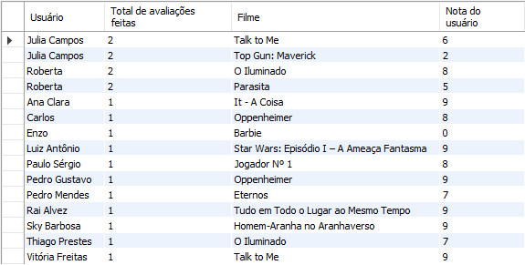

   2. ## **SQL para 3 consultas com IR (PK + FK) de recuperação de dados** 
      **Consulta 1**: 

      1) Descreva por qual razão a consulta é importante para o usuário.

         A consulta é importante pois permite uma visão completa de informações sobre um filme, incluindo seu gênero, diretor e o estúdio responsável por sua produção.

      2) Código SQL.

         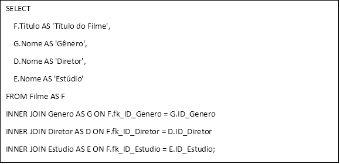

      3) Resultado da consulta.

         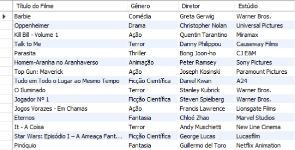

      **Consulta 2**: 

      1) Descreva por qual razão a consulta é importante para o usuário.

         A consulta é importante pois permite que um usuário veja todas as avaliações de um filme 		específico, como a popularidade e as opiniões dos usuários. 

      2) Código SQL.

         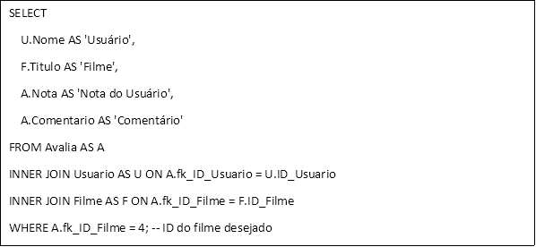

      3) Resultado da consulta.

         

      **Consulta 3**: 

      1) Descreva por qual razão a consulta é importante para o usuário.

         A consulta é importante para o usuário que deseja obter informações sobre o elenco do filme. 

      2) Código SQL.

         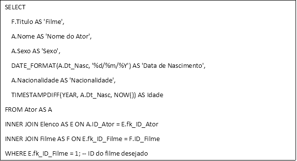

      3) Resultado da consulta.

         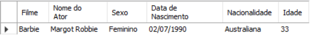

   3. ## **1 Stored procedure**
      **SP 1**: 

      1) Descreva o que a *Stored Produceure* (SP) faz (valores de INPUT e de OUTPUT).

         Essa Stored Produceure é projetada para calcular a média de avaliação de um filme com base 		em seu ID e recuperar o nome desse filme.

         INPUT: ID\_Filme - Este é o ID do filme para o qual o usuário deseja calcular a média de 			avaliação.

         OUTPUT: MediaAvaliacao - Este é o valor de saída que conterá a média das notas de avaliação 		para o filme especificado.

         OUTPUT: NomeFilme - Este é o valor de saída que conterá o nome do filme.

      2) Descreva por qual razão a SP é importante para o usuário.

         É importante para o usuário porque fornece a média das avaliações e o nome do filme, o que é 	útil para dar contexto ao usuário sobre qual filme a média se refere.

      3) Código SQL

         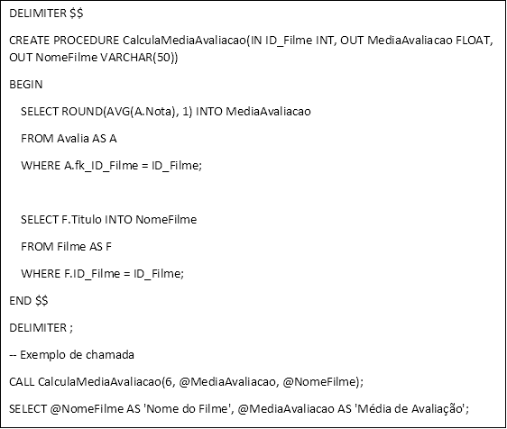

      4) Resultado da execução da SP

         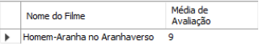

   4. ## **1 Trigger**
      **Trigger 1**: 

      1) Descreva o que o *Trigger* faz para as operações de INSERT / UPDATE / DELETE.

         Este trigger é disparado antes de uma operação de um INSERT na tabela "Avalia". Ele verifica se 	o valor da coluna "Nota" está dentro do intervalo válido de 1 a 10. Se o valor estiver fora desse 		intervalo, o trigger gera um erro personalizado.

      2) Descreva por qual razão o *Trigger* é importante para o usuário.

         Este trigger é importante para garantir a integridade dos dados na tabela "Avalia". Os usuários 		que inserem avaliações de filmes devem fornecer notas válidas dentro do intervalo especificado 	(1 a 10). Se alguém tentar inserir uma nota fora desse intervalo, o trigger impedirá a inserção e 		fornecerá uma mensagem de erro indicando o motivo. Isso ajuda a manter a qualidade das		avaliações e evita a entrada de dados incorretos.

      3) Código SQL	

         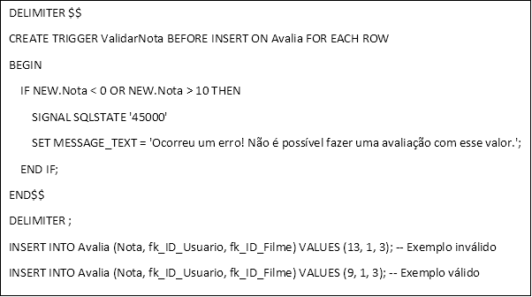

      4) Resultado da execução do *Trigger*

         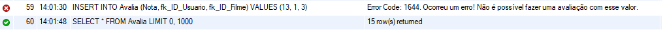
